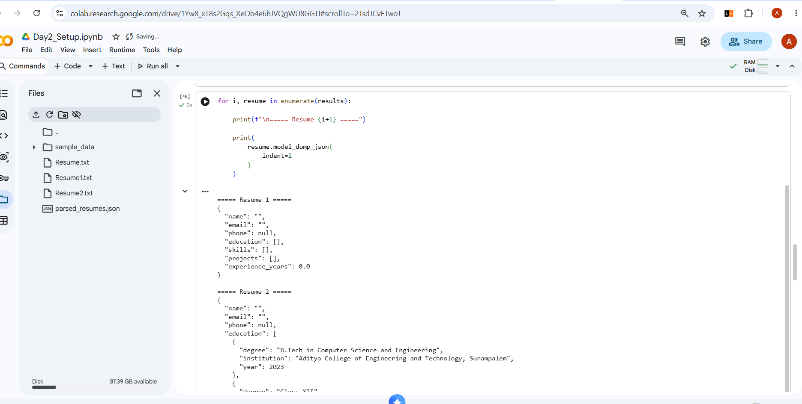
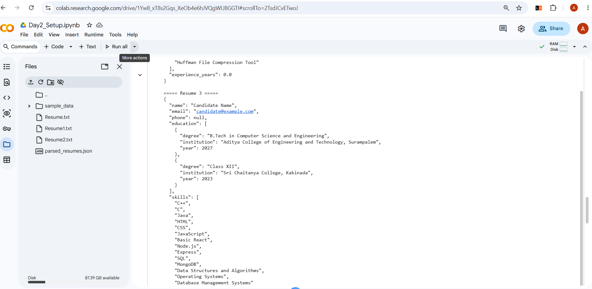
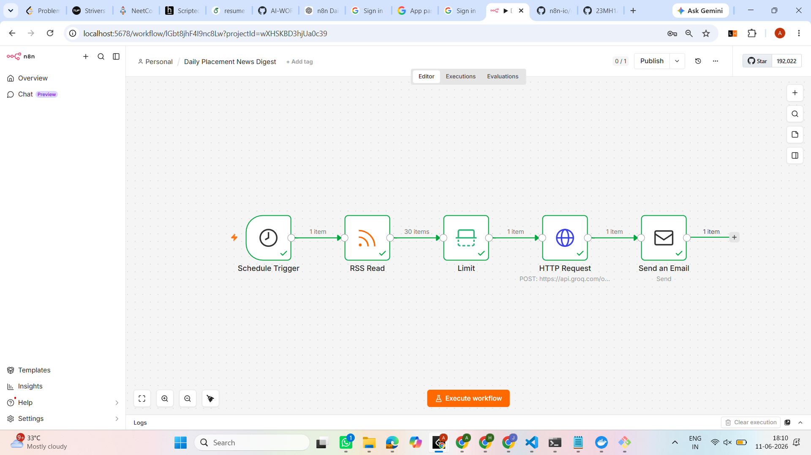
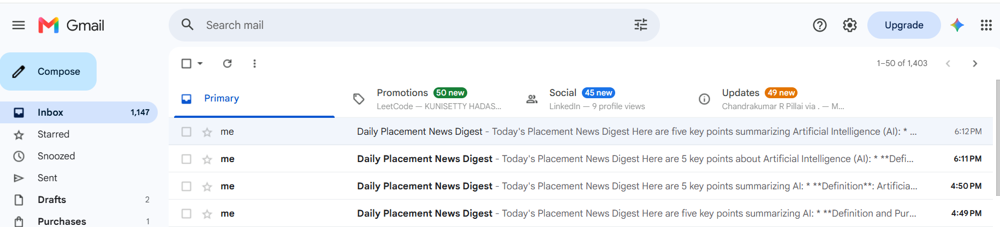
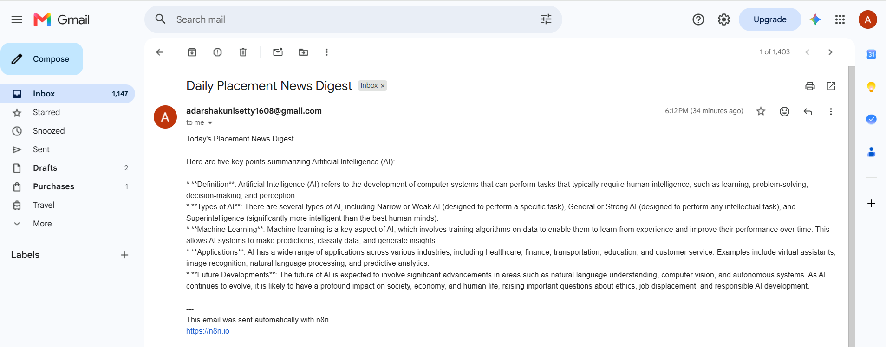
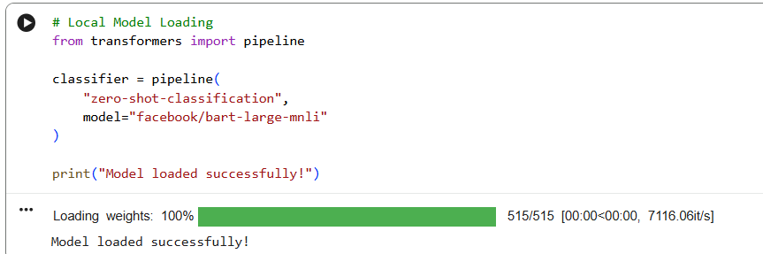
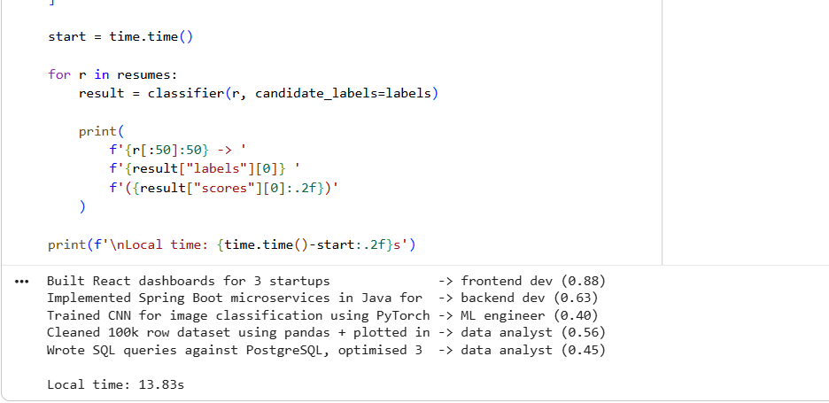
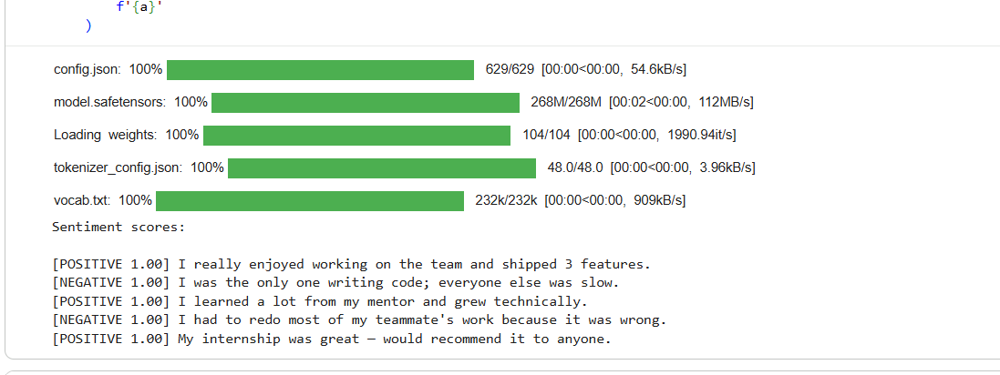
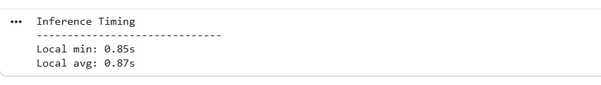

# AI Mentor Bootcamp — HADASSA KUNISETTY

Repo URL - https://github.com/23MH1A05M8/AI-WORKSHOP 

Public portfolio of 12-day AI Trainer Workshop. By Day 12: 6 daily notebooks + capstone Streamlit URL.

## Day 1 — Setup complete

- ✅ Google AI Studio API key provisioned
- ✅ Groq API key provisioned
- ✅ Hello-Gemini call working — see [Day1_Setup.ipynb](Day1_Setup.ipynb)


- ✅ Hello-Groq call working — see [Day1_Setup_groq.ipynb](Day1_Setup_groq.ipynb)
  


- 4-tool comparison matrix from Lab 1A: see screenshot below

  
## Day 2 Lab 2B – JSON Resume Extractor
Objective

Build an AI-powered resume extraction pipeline that converts unstructured resume text into structured JSON using Gemini's Structured Output API and validates the output using Pydantic.

### Technologies Used
  Python
  Google Gemini 2.5 Flash
  Pydantic
  Google Colab
### Implementation
  Defined a structured Resume schema using Pydantic models.
  Configured Gemini Structured Output using response_schema.
  Extracted candidate information from resume text into JSON format.
  Validated model output against the predefined schema.
  Implemented retry logic to repair malformed JSON responses.
  Processed multiple resumes and converted them into structured data objects.
  Added validation for empty input and handled extraction failures gracefully.
### Fields Extracted
  Name
  Email
  Phone Number
  Education Details
  Skills
  Projects
  Experience (Years)
  




## Day4A - Productivity Sprint

**Company:** Amazon (SDET Intern)

### Edit Notes

1. Verified interview process using Amazon careers information and candidate interview experiences.
2. Compensation figures varied across sources; marked as "[verify with official offer letter]".
3. Replaced Gamma's generic cover title with "Build Quality at Scale — Launch Your SDET Career at Amazon".

### Files

* `Day4_Amazon_brief.pdf`
* `Day4_AMAZON_deck.pdf`

### Sources

* Amazon Careers
* Amazon Jobs
* Glassdoor interviews
* GeeksforGeeks interview experiences
* LeetCode discussions
* AmbitionBox
* LinkedIn job postings

# Day 4 — Lab 4B: n8n Daily News Digest

A self-hosted, automated workflow that fetches daily placement and tech news via RSS, processes and summarizes the text using the Groq API, and emails a concise 5-bullet digest every morning.

---

## 🛠️ Tech Stack & Workflow

*   **Host:** Self-hosted via Docker (`docker-compose`)
*   **Automation Engine:** n8n
*   **LLM API:** Groq (`api.groq.com/openai/v1/chat/completions`)
*   **Delivery:** Gmail / SMTP Node

### Workflow Architecture
`Schedule Trigger (7:00 AM IST)` ➔ `RSS Read Node` ➔ `HTTP Request (Groq API)` ➔ `Gmail / SMTP Send Node`

---

## 🚀 Setup & Execution

1.  **Start n8n Instance:**
```bash
    docker compose -f n8n_docker-compose.yml up -d
```
2.  **Configure Workflow:** Imported and wired the nodes on `localhost:5678`.
3.  **Prompt Optimization:** Integrated a custom system prompt within the Groq payload to restrict summaries to 5 bullets (≤ 20 words per bullet) focusing on hiring, layoffs, and tech demand.
4.  **Activation:** Set Cron expression to `0 7 * * *` and toggled the workflow to **Active**.


## 📦 Deliverables

*   ✅ **Workflow JSON:** [Day4_NewsDigest.json](Day4_NewsDigest.json)
*   ✅ **Status:** Active & Automated

### Verification Screenshot








## Day 5A — Résumé Scorer Streamlit

**Live URL:** [https://<your-app>.streamlit.app](https://resumescorer-q8c9sdqbvznp9pkema5ptv.streamlit.app/)
**Code:** app.py  |  **Acceptance log:** acceptance_log.md
**Tools:** Continue.dev + Groq (llama-3.1-8b-instant) + Streamlit Community Cloud

### Features
- Fit score with rationale
- 4-axis bar chart breakdown (technical skills, soft skills, experience relevance, project fit)
- Missing skills + free learning resources with direct links

### Reflection
- **Vibe vs engineered:** Vibe-coded. To productionise, I'd add caching, rate limiting per user, and better error handling for when Groq returns malformed JSON.
- **What Continue.dev did well:** Scaffolded the Streamlit layout fast and generated both the bar chart and learning resources sections in one prompt update.
- **What I had to fix:** Continue.dev introduced indentation errors when adding new features — had to manually correct the prompt block and missing skills section back to the right indent level. Also had to switch from Gemini to Groq due to 503 availability issues, and update the model from the decommissioned llama3-8b-8192 to llama-3.1-8b-instant.


# Day 5 Lab 5B — Hugging Face Pulls

## Objective

Compare Hugging Face models using local inference and understand the trade-offs between API-based and local model execution.

## Models Tested

### 1. Zero-Shot Classification

* Model: `facebook/bart-large-mnli`
* Task: Resume classification

### 2. Sentiment Analysis

* Model: `distilbert-base-uncased-finetuned-sst-2-english`
* Task: Interview answer sentiment detection

---

## Resume Classification Results

| Resume Skill              | Predicted Role     |
| ------------------------- | ------------------ |
| React Dashboards          | Frontend Developer |
| Spring Boot Microservices | Backend Developer  |
| PyTorch CNN               | ML Engineer        |
| Pandas + Seaborn          | Data Analyst       |
| PostgreSQL Optimization   | Backend Developer  |

---

## Sentiment Analysis Results

| Interview Response          | Sentiment |
| --------------------------- | --------- |
| Enjoyed working on the team | Positive  |
| Everyone else was slow      | Negative  |
| Learned a lot from mentor   | Positive  |
| Teammate's work was wrong   | Negative  |
| Internship was great        | Positive  |

---

## Timing Comparison

| Method                | Min   | Avg   | Notes                                          |
| --------------------- | ----- | ----- | ---------------------------------------------- |
| HF Inference API      | N/A   | N/A   | API endpoint resolution issue in Colab runtime |
| Local Colab Inference | 0.85s | 0.87s | Model already loaded in memory                 |

---
### Model Loading


### Resume Classification


### Sentiment Analysis


### Timing Results


## Reflection

1. Hugging Face API is useful for lightweight applications because no model download is required.
2. Local inference is suitable for repeated or batch processing once the model has been downloaded.
3. Sentiment models detect surface tone rather than speaker intent, which is important when evaluating interview responses.

