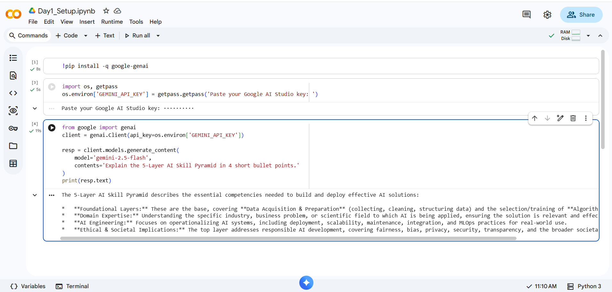
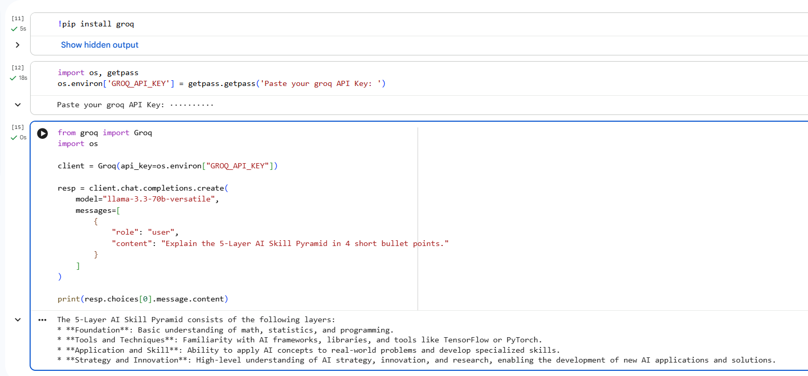

# AI Mentor Bootcamp — HADASSA KUNISETTY

Repo URL - https://github.com/23MH1A05M8/AI-WORKSHOP 

Public portfolio of 12-day AI Trainer Workshop. By Day 12: 6 daily notebooks + capstone Streamlit URL.

## Day 1 — Setup complete

- ✅ Google AI Studio API key provisioned
- ✅ Groq API key provisioned
- ✅ Hello-Gemini call working — see [Day1_Setup.ipynb](Day1_Setup.ipynb)



- ✅ Hello-Groq call working — see [Day1_Setup_groq.ipynb](Day1_Setup_groq.ipynb)
  


- 4-tool comparison matrix from Lab 1A: see screenshot below
```
